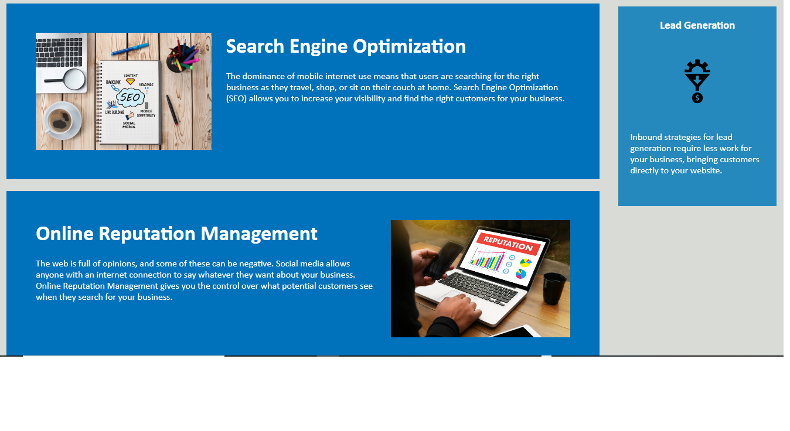
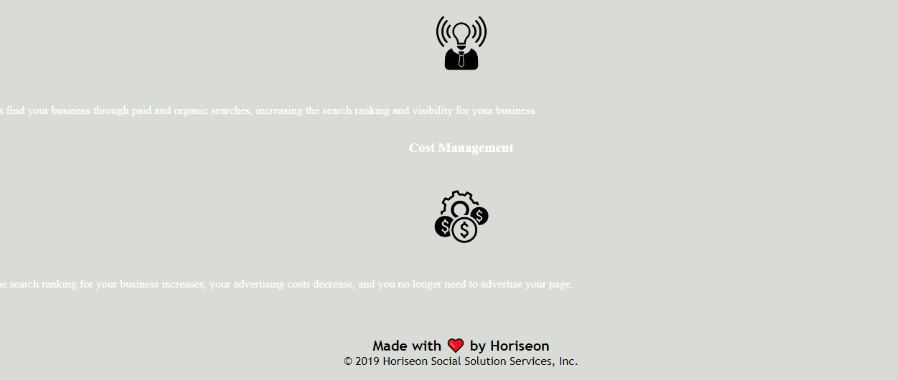

## Features

This website was part of an exercise to refactor an existing site.
The html was updated to reflect semantic html elements. The CSS was consolidated to be clearer; the images were given alt text attributes.

## Usage 

Click on the navigation links in the header to go to each section. 

see screenshots below.

```md





## License

Uses the MIT license.